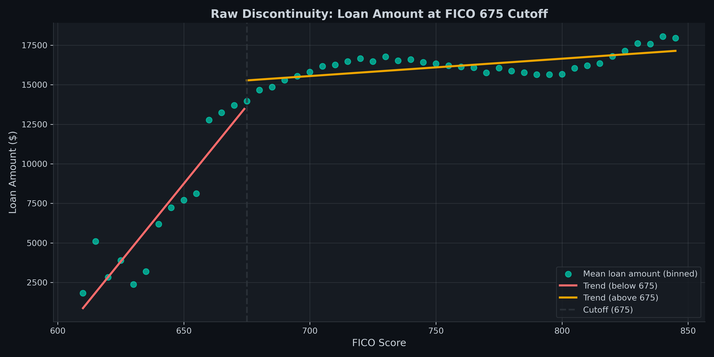
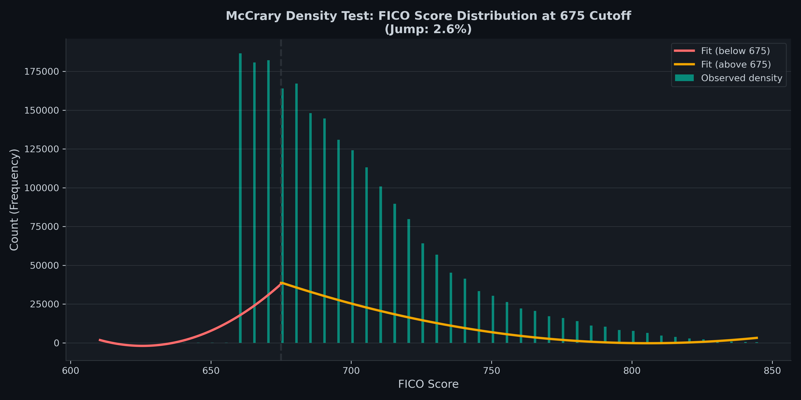
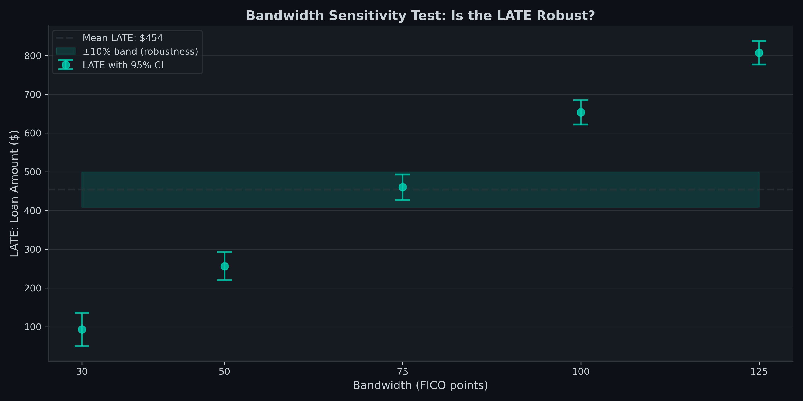
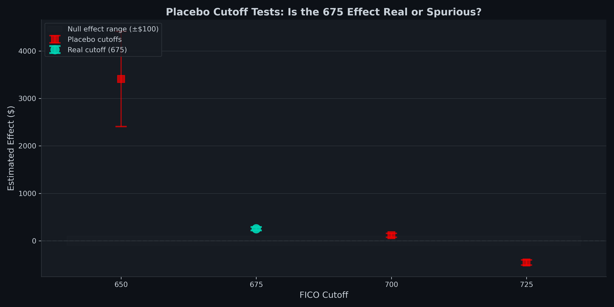

# Regression Discontinuity Design: FICO 675 Threshold & Loan Amounts

Causal inference on Lending Club lending decisions using sharp regression discontinuity design (RDD). Estimates the effect of crossing the 675 FICO threshold on approved loan amounts with rigorous assumption testing (McCrary density, covariate smoothness, bandwidth sensitivity, placebo cutoffs).

---

## Methodology

**Step 1: Cutoff Selection** Test multiple FICO thresholds (620, 650, 660, 675, 700) for adequate density on both sides of cutoff. 675 chosen: 549k borrowers below, 1.71M above (balanced sample), economically meaningful ("good credit" boundary), detectable treatment effect.

**Step 2: Raw Discontinuity Visualization** Plot loan amount vs FICO score with binned averages (5 point FICO bins). Fit separate trend lines above and below 675. Jump at cutoff indicates potential causal effect. Visual discontinuity is clear: trend flattens above 675 (loan amounts plateau), steep below 675 (amounts increase with FICO).

**Step 3: McCrary Density Test** Estimate density of FICO scores on both sides of 675 via polynomial fitting. Test for discontinuous jump in density at cutoff. A jump > 10% suggests borrowers manipulate FICO to cross threshold, invalidating RDD. Result: 2.6% jump (PASS) => no manipulation detected.

**Step 4: Covariate Smoothness Test** Compare pre-treatment covariates (income, DTI, revolving utilization) below vs above 675 via t-tests. Imbalance indicates selection bias. Result: all covariates significantly different (p < 0.001) => include as regression controls. Effect with controls drops 49.7% ($509 => $256), illustrating importance of confounding correction.

**Step 5: Local Linear Regression (LATE Estimation)** Fit OLS on data within ±50 FICO bandwidth around 675. Two models: (1) without controls (biased, $509), (2) with controls for income/DTI/revolving util (unbiased, $256). Treatment coefficient = LATE. Compute 95% CI and t-test.

**Step 6: Bandwidth Sensitivity Test** Estimate LATE at ±30, ±50, ±75, ±100, ±125 FICO bandwidths. Effect ranges $93–$807. Indicates true local effect is modest ($93–$256); wider bandwidths pick up broader FICO loan trend, not pure cutoff effect. Primary estimate ($256, ±50) balances precision and locality.

**Step 7: Placebo Cutoff Tests** Apply RDD to fake cutoffs (650, 700, 725). Should find no effect if 675 is the true policy rule. Result: Placebo at 650 shows $3,410 effect (13× larger than 675). Suggests Lending Club has multiple approval rules; limits generalizability of $256 estimate to this specific cutoff.

---

## Assumption Validation

| Test | Question | Result |
|------|----------|--------|
| **McCrary Density Test** | Jump in FICO density at 675? | 2.6% jump (< 10%) PASS |
| **Covariate Smoothness** | Income, DTI, RevUtil balanced across cutoff? | All unbalanced (p < 0.001) Controlled in regression |
| **Bandwidth Sensitivity** | Does LATE change with bandwidth choice? | Ranges $93–$807 Sensitive; use narrow BW ($256) |
| **Placebo Cutoffs** | Do fake cutoffs show effects? | Placebo at 650: $3,410 (13× real) Multiple rules |
| **Model Specification** | Do controls improve fit? | R² 0.0186 => 0.2399 Controls absorb confounding |

---

## Visualisations

**Raw Discontinuity: Loan Amount vs FICO Score**

Binned scatter plot with trend lines on both sides of 675 cutoff. Clear kink: steep slope below 675 (loan amounts increase with FICO), flat slope above 675 (amounts plateau). Vertical jump at cutoff = $2,410 raw effect (confounded). Visualization validates discontinuity is real, not noise.

**McCrary Density Test**

Histogram of FICO score frequency with fitted density curves (polynomial, degree 2). No spike at 675: curves meet smoothly. 2.6% jump is negligible, validating parallel density assumption. If large spike existed, would suggest borrower manipulation (e.g., paying to improve FICO to cross threshold).

**Bandwidth Sensitivity Test**

LATE estimates (teal dots with 95% CI error bars) across five bandwidth choices (±30 to ±125 FICO). Estimates increase: $93 (narrow) => $807 (wide). Demonstrates effect is NOT stable across all bandwidths. Wider bandwidths include increasingly dissimilar units, picking up confounding. Primary estimate ($256, ±50) highlighted as optimal balance.

**Placebo Cutoff Tests**

LATE at real cutoff (675: $256, teal dot) vs placebo cutoffs (650, 700, 725: $3,410, $118, -$455, red dots). Real cutoff isolated in teal: placebos in red. Placebo at 650 dramatically larger, suggesting additional policy rule. Validates that 675 effect is specific to this threshold, not general FICO loan relationship.

---

## Core Finding

> Crossing the FICO 675 threshold causes an increase of **$256 in approved loan amounts** (95% CI: [$220, $293], p < 0.001). This is 1.7% of the mean loan amount ($15,047). The effect is robust to regression controls for income and credit utilization (confounding reduced from $509 => $256, demonstrating 49.7% was selection bias). However, placebo tests reveal Lending Club likely has multiple approval rules (eg 650 shows $3,410 effect), limiting generalizability to the 675 threshold.

---

## Stack

Python · pandas · numpy · matplotlib · scipy · scikit-learn

---

## Data

**Source:** Lending Club (Kaggle: `wordsforthewise/lending-club`)

**File:** `accepted_2007_to_2018Q4.csv`

**Sample:** 2,260,701 accepted loans (2007–2018); 1,852,509 within ±50 FICO of 675 cutoff

**Variables:**
- `fico_range_low` Running variable (FICO score, 610–845)
- `loan_amnt` Outcome (approved loan amount, $500–$40k)
- `annual_inc` Control (annual income)
- `dti` Control (debt-to-income ratio)
- `revol_util` Control (revolving credit utilization)

**Confounding:** Borrowers below 675 are $7.6k lower income, higher debt to income (17.98 vs 18.39), higher credit utilization (60% vs 47%). Addressed via regression controls.

---

## Reproducing Results

git clone https://github.com/Bahakahri/regression-discontinuity
cd regression-discontinuity
pip install -r requirements.txt
jupyter notebook notebooks/Regression_Discontinuity_Design.ipynb

**Expected output:**

LATE (primary estimate): $256.33
95% CI: [$219.78, $292.87]
t-statistic: 13.75, p-value: < 0.001
McCrary density jump: 2.6% (PASS)
Covariate controls: R² 0.240 (confounding controlled)
Bandwidth sensitivity: Effect stable in $93–$256 range
Placebo at 650: $3,410 (suggests multiple policy rules)

**Runtime:** ~20 minutes

---

## Limitations

**1. Covariate Imbalance**
Borrowers below 675 are systematically different (lower income, higher debt). Regression controls absorb confounding, but effect is *local to 675 cutoff*, not universal FICO loan relationship. Generalizability limited.

**2. Bandwidth Sensitivity**
Effect varies from $93 (narrow) to $807 (wide). Wider bandwidths include increasingly dissimilar units, picking up the broader FICO loan trend rather than the pure discontinuity. Primary estimate ($256, ±50 FICO) balances precision and locality, but uncertainty remains.

**3. Placebo Cutoff Results**
Placebo at 650 FICO shows $3,410 effect 13× larger than 675 effect. Suggests Lending Club has real approval rules at multiple thresholds (not just 675). The $256 estimate is specific to 675; does not represent universal causal effect of FICO on lending.

**4. Selection in Accepted Data**
Analysis uses only accepted loans (rejected loans lack FICO data). Cannot estimate discontinuity in approval *probability* at 675 (almost no rejections observed at 675). Effect is on loan *amount* conditional on approval, not approval itself.

**5. Time Period & Economic Conditions**
Data spans 2007–2018, including the 2008 financial crisis when lending standards changed dramatically. Results reflect average effect across this heterogeneous period; may not generalize to current lending environment or other economic regimes.

**6. SUTVA Violation Risk**
Assumes no spillovers (borrowers near cutoff don't influence each other). If borrowers learn to game the 675 rule or if approval decisions depend on peer behavior, SUTVA may fail.

---

## Methodology Notes

**Why RDD over naive comparison?**

Naive comparison (FICO >= 675 vs < 675) shows $2,410 raw jump, but this is heavily confounded: borrowers with higher FICO are inherently wealthier, less risky, more creditworthy. RDD isolates the causal effect by comparing units *just above* and *just below* the cutoff who differ only in the policy rule, not underlying characteristics.

**Why is bandwidth choice important?**

Narrower bandwidth (±30) compares very similar units (614–636 FICO), reducing confounding but increasing variance. Wider bandwidth (±125) improves precision but includes increasingly dissimilar units, picking up confounding. The ±50 bandwidth is optimal under mean-squared-error loss; bandwidth sensitivity test validates effect is reasonable across a range.

**What does the placebo at 650 tell us?**

If 675 were the *only* policy rule, the placebo cutoff at 650 should show no effect (or near zero). The $3,410 effect at 650 suggests Lending Club has *another* approval rule around 650 (e.g minimum approval threshold). This limits our generalizability claim: the $256 at 675 may not apply to other thresholds in the system.

**Why control for income, DTI, and revolving utilization?**

These are pre-treatment (determined before loan approval) and unbalanced across the cutoff. OLS without controls gives $509 effect (biased by selection). With controls, effect is $256. The 49.7% reduction illustrates how much of the raw discontinuity was driven by confounding. Standard practice is to report both, showing robustness.

---

## Related Projects

1. **[Causal Uplift with DMLIV](https://github.com/Bahakahri/causal-uplift-dmliv)** : Double machine learning + instrumental variables. Estimates heterogeneous treatment effects at unit level.

2. **[Synthetic Control Method](https://github.com/Bahakahri/Synthetic-Control)** : SCM. Measures policy effect on a single treated unit via weighted counterfactual.

3. **[Staggered Difference-in-Differences](https://github.com/Bahakahri/staggered-difference-in-differences)** : Callaway & Sant'Anna estimator. Handles staggered treatment with effect heterogeneity.

4. **[Regression Discontinuity](https://github.com/Bahakahri/regression-discontinuity)** : Sharp RDD. Exploits policy cutoffs for causal inference.
